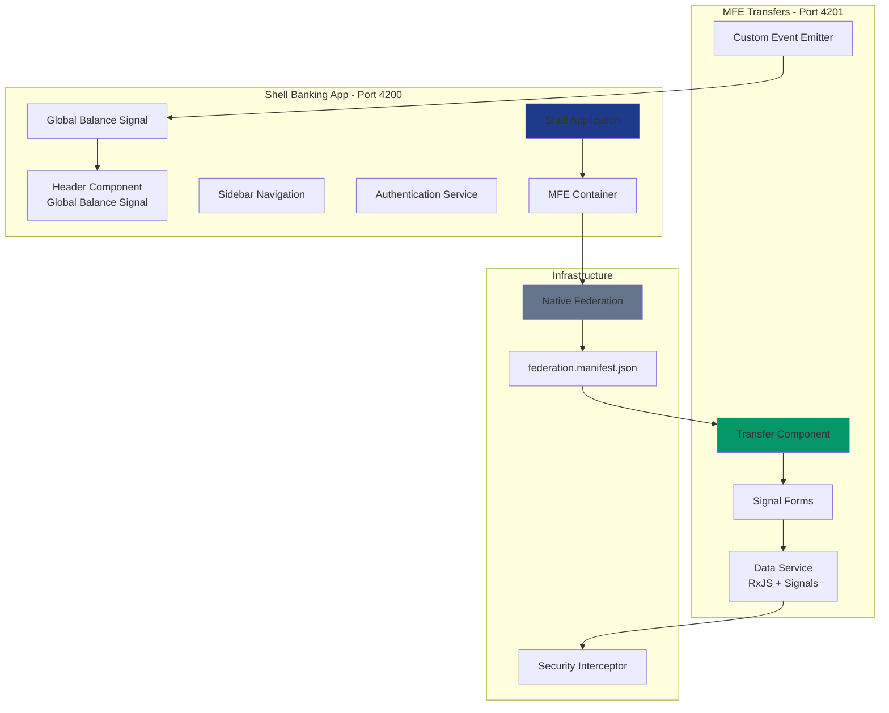
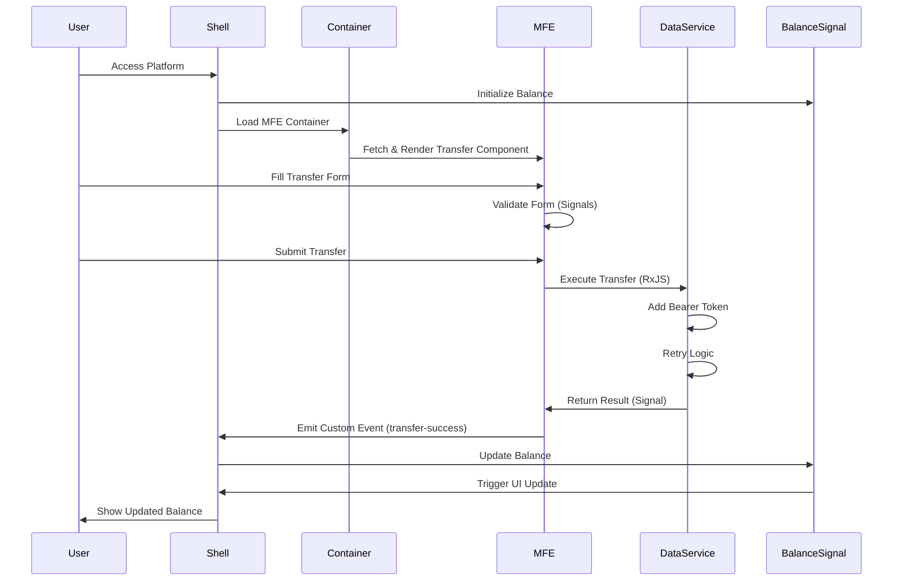
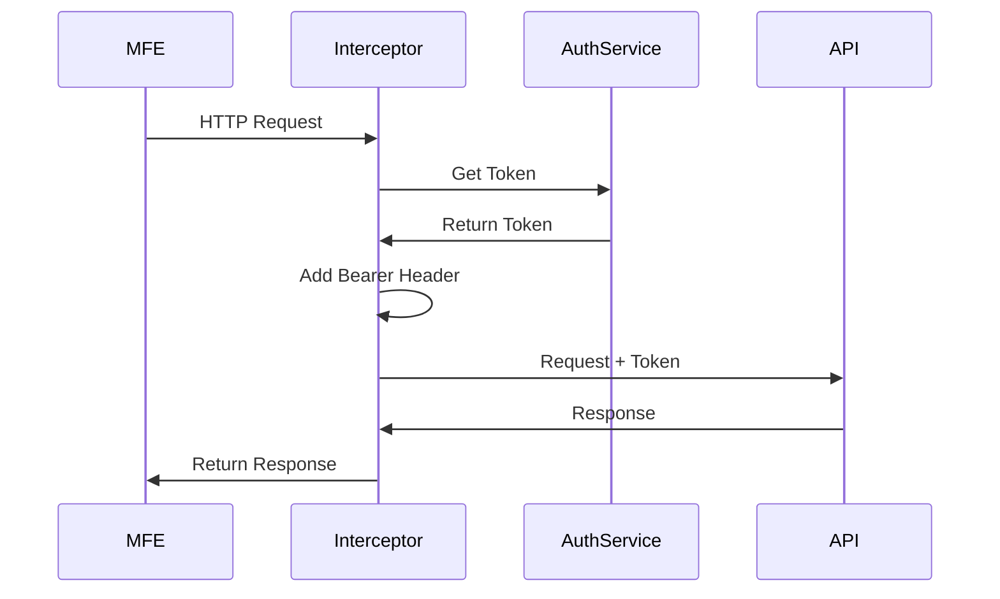
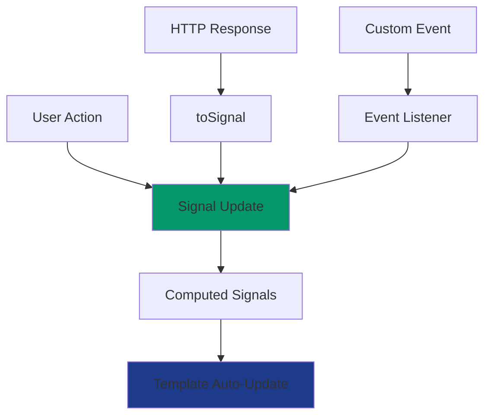

# Banking Platform - Micro Frontend Architecture Plan

## Executive Summary

This document outlines the architecture for a modern banking platform built with Angular 21, leveraging Micro Frontend architecture using Native Federation. The platform consists of a Shell application (host) and a Transfers MFE (remote), implementing a signals-first reactive approach with SSR capabilities.

---

## Architecture Overview

### High-Level Architecture



### Communication Flow



---

## Project Structure

### Directory Layout

```
angular-test/
├── plans/
│   └── banking-platform-architecture.md
├── shell-banking-app/                    # Port 4200 - Host Application
│   ├── src/
│   │   ├── app/
│   │   │   ├── core/
│   │   │   │   ├── services/
│   │   │   │   │   ├── balance.service.ts
│   │   │   │   │   └── auth.service.ts
│   │   │   │   ├── guards/
│   │   │   │   │   └── auth.guard.ts
│   │   │   │   └── interceptors/
│   │   │   │       └── security.interceptor.ts
│   │   │   ├── layout/
│   │   │   │   ├── header/
│   │   │   │   │   └── header.component.ts
│   │   │   │   └── sidebar/
│   │   │   │       └── sidebar.component.ts
│   │   │   ├── features/
│   │   │   │   └── mfe-container/
│   │   │   │       └── mfe-container.component.ts
│   │   │   └── app.component.ts
│   │   ├── assets/
│   │   └── styles/
│   │       └── tailwind.css
│   ├── federation.config.js
│   ├── federation.manifest.json
│   ├── angular.json
│   ├── tailwind.config.js
│   └── package.json
│
└── mfe-transfers/                        # Port 4201 - Remote Application
    ├── src/
    │   ├── app/
    │   │   ├── features/
    │   │   │   └── transfer/
    │   │   │       ├── transfer.component.ts
    │   │   │       └── transfer-form.model.ts
    │   │   ├── services/
    │   │   │   ├── transfer-data.service.ts
    │   │   │   └── event-bus.service.ts
    │   │   └── app.component.ts
    │   ├── assets/
    │   └── styles/
    │       └── tailwind.css
    ├── federation.config.js
    ├── angular.json
    ├── tailwind.config.js
    └── package.json
```

---

## Technical Specifications

### Technology Stack

| Component | Technology | Version | Purpose |
|-----------|-----------|---------|---------|
| Framework | Angular | 21+ | Core framework |
| Change Detection | Zoneless | Experimental | Performance optimization |
| Module Federation | Native Federation | Latest | Micro frontend architecture |
| Build Tool | esbuild | Via Angular CLI | Fast builds |
| State Management | Signals | Angular 21 | Reactive state |
| Forms | Signal Forms | Experimental | Reactive forms |
| HTTP | RxJS | 7+ | Async operations |
| Styling | Tailwind CSS | v4 | UI styling |
| SSR | Angular SSR | 21+ | Server-side rendering |
| Hydration | Incremental | Angular 21 | Progressive hydration |

### Color Palette (Tailwind CSS)

```css
/* Professional Banking Theme */
Primary (Navy Blue): #1e3a8a (blue-900)
Secondary (Slate Gray): #64748b (slate-500)
Success (Emerald): #059669 (emerald-600)
Warning (Amber): #d97706 (amber-600)
Error (Red): #dc2626 (red-600)
Background: #f8fafc (slate-50)
Text Primary: #0f172a (slate-900)
Text Secondary: #475569 (slate-600)
```

---

## Component Specifications

### Shell Banking App (Host)

#### 1. Balance Service (Signals-First)

**File**: [`balance.service.ts`](shell-banking-app/src/app/core/services/balance.service.ts)

```typescript
Features:
- WritableSignal<number> for global balance
- Computed signals for formatted balance
- Methods to update balance
- Event listener for transfer-success events
```

#### 2. Header Component

**File**: [`header.component.ts`](shell-banking-app/src/app/layout/header/header.component.ts)

```typescript
Features:
- Display global balance using signal
- User profile section
- Responsive design with Tailwind
- Real-time balance updates
```

#### 3. Sidebar Component

**File**: [`sidebar.component.ts`](shell-banking-app/src/app/layout/sidebar/sidebar.component.ts)

```typescript
Features:
- Navigation menu
- Active route highlighting
- Icons for menu items
- Collapsible on mobile
```

#### 4. MFE Container Component

**File**: [`mfe-container.component.ts`](shell-banking-app/src/app/features/mfe-container/mfe-container.component.ts)

```typescript
Features:
- Dynamic component loading
- Load MFE from federation manifest
- Error boundary handling
- Loading states
```

#### 5. Authentication Service

**File**: [`auth.service.ts`](shell-banking-app/src/app/core/services/auth.service.ts)

```typescript
Features:
- Signal-based auth state
- Mock login/logout
- Token management
- User profile signal
```

#### 6. Security Interceptor

**File**: [`security.interceptor.ts`](shell-banking-app/src/app/core/interceptors/security.interceptor.ts)

```typescript
Features:
- Add Bearer token to requests
- Handle 401 responses
- Token refresh simulation
- Banking security standards
```

---

### MFE Transfers (Remote)

#### 1. Transfer Component

**File**: [`transfer.component.ts`](mfe-transfers/src/app/features/transfer/transfer.component.ts)

```typescript
Features:
- Signal Forms implementation
- Real-time validation feedback
- Amount and destination account fields
- Submit handler with loading state
- Success/error messaging
```

#### 2. Transfer Data Service

**File**: [`transfer-data.service.ts`](mfe-transfers/src/app/services/transfer-data.service.ts)

```typescript
Features:
- RxJS observable for HTTP simulation
- Retry logic (3 attempts with exponential backoff)
- Convert observable to signal using toSignal()
- In-memory mock data
- Delay simulation for realistic UX
```

#### 3. Event Bus Service

**File**: [`event-bus.service.ts`](mfe-transfers/src/app/services/event-bus.service.ts)

```typescript
Features:
- Emit custom events to Shell
- Type-safe event payloads
- transfer-success event with amount
- Decoupled communication pattern
```

---

## Federation Configuration

### Shell (Host) Configuration

**File**: [`federation.config.js`](shell-banking-app/federation.config.js)

```javascript
Key Configuration:
- Name: 'shell-banking-app'
- Exposes: None (host only)
- Remotes: Load from manifest
- Shared: Angular core, common, router
```

**File**: [`federation.manifest.json`](shell-banking-app/federation.manifest.json)

```json
{
  "mfe-transfers": "http://localhost:4201/remoteEntry.json"
}
```

### MFE (Remote) Configuration

**File**: [`federation.config.js`](mfe-transfers/federation.config.js)

```javascript
Key Configuration:
- Name: 'mfe-transfers'
- Filename: 'remoteEntry.json'
- Exposes: './Component' -> TransferComponent
- Shared: Angular core, common, forms
```

---

## Signal Forms Implementation

### Transfer Form Model

```typescript
Features:
- FormGroup with signals
- Real-time validation
- Custom validators for banking rules
- Computed signals for form state

Validations:
- Amount: Required, min 1, max 1000000
- Destination Account: Required, pattern (10 digits)
- Source Account: Required, different from destination
```

---

## Communication Pattern

### Custom Events Flow


### Event Structure

```typescript
Event Name: 'transfer-success'
Payload: {
  amount: number,
  timestamp: Date,
  transactionId: string
}
```

---

## SSR & Hydration Strategy

### Configuration

```typescript
Features:
- provideClientHydration(withIncrementalHydration())
- Server-side rendering enabled
- Progressive hydration for performance
- Edge-ready deployment

Benefits:
- Faster initial load
- Better SEO (if needed)
- Improved Core Web Vitals
- Reduced Time to Interactive
```

---

## Security Implementation

### Bearer Token Flow



### Security Features

- Bearer token authentication
- Token stored in memory (not localStorage)
- Automatic token injection
- 401 handling with redirect
- HTTPS enforcement (production)
- CORS configuration

---

## Development Workflow

### Running the Applications

```bash
# Terminal 1 - Shell Application
cd shell-banking-app
npm start
# Runs on http://localhost:4200

# Terminal 2 - MFE Transfers
cd mfe-transfers
npm start
# Runs on http://localhost:4201
```

### Build Process

```bash
# Production builds
cd shell-banking-app
npm run build

cd mfe-transfers
npm run build
```

---

## State Management Strategy

### Signals-First Approach



### Signal Types Used

1. **WritableSignal**: Global balance, form fields
2. **Computed**: Formatted balance, form validity
3. **toSignal**: HTTP response conversion
4. **effect**: Side effects (logging, analytics)

---

## Testing Strategy

### Unit Testing

- Component testing with Signal mocks
- Service testing with RxJS TestScheduler
- Interceptor testing with HttpTestingController
- Form validation testing

### Integration Testing

- MFE loading and rendering
- Event communication between Shell and MFE
- Balance update flow
- Form submission flow

### E2E Testing

- Complete transfer flow
- Authentication flow
- Navigation between features
- Responsive design validation

---

## Performance Optimizations

### Implemented Optimizations

1. **Zoneless Change Detection**: Eliminates Zone.js overhead
2. **Incremental Hydration**: Progressive page interactivity
3. **Signal-based Reactivity**: Fine-grained updates
4. **Native Federation**: Optimized module loading
5. **esbuild**: Fast build times
6. **Lazy Loading**: MFE loaded on demand
7. **Tree Shaking**: Minimal bundle size

### Expected Metrics

- First Contentful Paint: < 1.5s
- Time to Interactive: < 3s
- Bundle Size (Shell): ~150KB gzipped
- Bundle Size (MFE): ~50KB gzipped

---

## Deployment Considerations

### Production Checklist

- [ ] Environment-specific federation manifests
- [ ] CDN configuration for MFE hosting
- [ ] HTTPS enforcement
- [ ] Security headers (CSP, HSTS)
- [ ] Error tracking integration
- [ ] Analytics implementation
- [ ] Performance monitoring
- [ ] A/B testing infrastructure

### Hosting Options

1. **Vercel/Netlify**: Edge SSR support
2. **AWS CloudFront + S3**: Traditional CDN
3. **Azure Static Web Apps**: Integrated solution
4. **Google Cloud Run**: Container-based

---

## Future Enhancements

### Phase 2 Features

1. Additional MFEs (Accounts, Cards, Investments)
2. Shared component library
3. Design system implementation
4. Advanced analytics
5. Real-time notifications
6. Multi-language support
7. Accessibility improvements (WCAG 2.1 AA)
8. Progressive Web App features

### Technical Debt Prevention

- Regular dependency updates
- Code quality gates (ESLint, Prettier)
- Performance budgets
- Automated testing coverage > 80%
- Documentation updates with code changes

---

## Risk Mitigation

### Identified Risks

| Risk | Impact | Mitigation |
|------|--------|------------|
| MFE loading failure | High | Error boundaries, fallback UI |
| Version conflicts | Medium | Strict shared dependencies |
| Performance degradation | Medium | Performance monitoring, budgets |
| Security vulnerabilities | High | Regular audits, dependency scanning |
| Browser compatibility | Low | Polyfills, feature detection |

---

## Conclusion

This architecture provides a solid foundation for a scalable, performant banking platform using modern Angular 21 features. The Micro Frontend approach enables independent development and deployment of features while maintaining a cohesive user experience.

The signals-first strategy combined with zoneless change detection positions the application for optimal performance, while Native Federation ensures efficient code sharing and loading.

---

## Appendix

### Key Dependencies

**Shell Banking App**:
```json
{
  "@angular/core": "^21.0.0",
  "@angular-architects/native-federation": "^18.0.0",
  "tailwindcss": "^4.0.0",
  "rxjs": "^7.8.0"
}
```

**MFE Transfers**:
```json
{
  "@angular/core": "^21.0.0",
  "@angular-architects/native-federation": "^18.0.0",
  "tailwindcss": "^4.0.0",
  "rxjs": "^7.8.0"
}
```

### Useful Resources

- [Angular Signals Documentation](https://angular.dev/guide/signals)
- [Native Federation Guide](https://www.angulararchitects.io/en/blog/native-federation/)
- [Angular SSR Documentation](https://angular.dev/guide/ssr)
- [Tailwind CSS v4 Documentation](https://tailwindcss.com/docs)

---

**Document Version**: 1.0  
**Last Updated**: 2025-12-26  
**Author**: Architecture Team  
**Status**: Ready for Implementation
