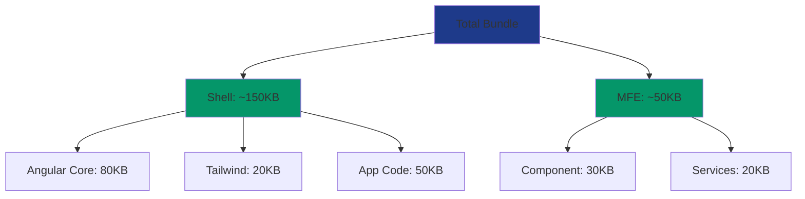
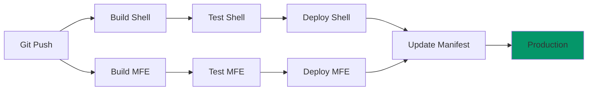

# Technical Decisions & Rationale

## Overview

This document explains the key technical decisions made for the Banking Platform Micro Frontend architecture and the reasoning behind each choice.

---

## Architecture Decisions

### 1. Micro Frontend Architecture

**Decision**: Use Native Federation for Micro Frontend implementation

**Rationale**:
- **Independent Deployment**: Each MFE can be deployed independently without affecting others
- **Team Autonomy**: Different teams can work on different MFEs with minimal coordination
- **Technology Flexibility**: Each MFE can use different versions of libraries (within constraints)
- **Scalability**: Easy to add new features as separate MFEs
- **Performance**: Native Federation with esbuild provides faster builds than Webpack Module Federation

**Trade-offs**:
- ✅ Better scalability and team independence
- ✅ Faster development cycles
- ❌ More complex initial setup
- ❌ Requires careful dependency management

---

### 2. Zoneless Change Detection

**Decision**: Enable `provideExperimentalZonelessChangeDetection()`

**Rationale**:
- **Performance**: Eliminates Zone.js overhead (~30KB bundle reduction)
- **Predictability**: Explicit change detection with Signals
- **Future-Proof**: Angular's direction for future versions
- **Better Control**: Developers have more control over when updates occur

**Trade-offs**:
- ✅ Significant performance improvement
- ✅ Smaller bundle size
- ✅ More predictable behavior
- ❌ Requires careful migration of existing code
- ❌ Some third-party libraries may not be compatible

**Migration Strategy**:
```typescript
// Old: Automatic change detection with Zone.js
setTimeout(() => {
  this.data = newData; // Automatically triggers change detection
}, 1000);

// New: Explicit with Signals
setTimeout(() => {
  this.data.set(newData); // Explicitly updates signal
}, 1000);
```

---

### 3. Signals-First State Management

**Decision**: Use Angular Signals as primary state management solution

**Rationale**:
- **Fine-Grained Reactivity**: Only affected components re-render
- **Simplicity**: No need for external state management libraries
- **Performance**: More efficient than traditional change detection
- **Type Safety**: Full TypeScript support
- **Composability**: Easy to create derived state with `computed()`

**Comparison with Alternatives**:

| Feature | Signals | RxJS | NgRx |
|---------|---------|------|------|
| Learning Curve | Low | Medium | High |
| Bundle Size | Minimal | Medium | Large |
| Boilerplate | Minimal | Medium | High |
| Async Support | Via toSignal() | Native | Native |
| DevTools | Basic | Good | Excellent |
| Best For | Simple state | Async flows | Complex apps |

**When to Use Each**:
- **Signals**: UI state, derived values, simple synchronous state
- **RxJS**: HTTP requests, complex async operations, event streams
- **NgRx**: Large applications with complex state requirements

---

### 4. Custom Events for MFE Communication

**Decision**: Use native Custom Events for Shell ↔ MFE communication

**Rationale**:
- **Decoupling**: MFEs don't need direct references to Shell services
- **Framework Agnostic**: Works with any framework (future-proof)
- **Simple**: Native browser API, no additional libraries
- **Type Safety**: Can be typed with TypeScript interfaces

**Alternative Approaches Considered**:

**Option A: Shared Service**
```typescript
// Pros: Type-safe, Angular-native
// Cons: Tight coupling, requires shared library
@Injectable({ providedIn: 'root' })
export class SharedStateService {
  balance = signal(0);
}
```

**Option B: RxJS Subject**
```typescript
// Pros: Powerful operators, familiar to Angular devs
// Cons: Requires RxJS knowledge, more complex
export class EventBus {
  private events$ = new Subject<Event>();
}
```

**Option C: Custom Events (Chosen)**
```typescript
// Pros: Decoupled, simple, framework-agnostic
// Cons: Less type-safe without careful typing
window.dispatchEvent(new CustomEvent('transfer-success', {
  detail: { amount: 100 }
}));
```

---

### 5. SSR with Incremental Hydration

**Decision**: Enable Server-Side Rendering with `withIncrementalHydration()`

**Rationale**:
- **Performance**: Faster First Contentful Paint (FCP)
- **SEO**: Better search engine indexing (if needed)
- **Progressive Enhancement**: Page is usable before full hydration
- **Core Web Vitals**: Improved Largest Contentful Paint (LCP)

**Hydration Strategy**:


**Trade-offs**:
- ✅ Faster perceived load time
- ✅ Better SEO
- ✅ Improved accessibility
- ❌ More complex deployment
- ❌ Requires Node.js server or edge runtime

---

### 6. Tailwind CSS v4

**Decision**: Use Tailwind CSS v4 for styling

**Rationale**:
- **Utility-First**: Rapid UI development
- **Consistency**: Design system built-in
- **Performance**: Purges unused styles in production
- **Customization**: Easy to extend with custom colors
- **Developer Experience**: IntelliSense support

**Banking-Specific Customization**:
```javascript
// Professional color palette for financial applications
colors: {
  'banking-navy': '#1e3a8a',    // Trust, stability
  'banking-slate': '#64748b',    // Neutral, professional
  'banking-emerald': '#059669',  // Success, growth
  'banking-amber': '#d97706',    // Warning, attention
  'banking-red': '#dc2626',      // Error, danger
}
```

**Alternative Approaches**:
- **Material Design**: More opinionated, larger bundle
- **Bootstrap**: Less flexible, older approach
- **Custom CSS**: More control, more maintenance

---

### 7. In-Memory Mock Services

**Decision**: Use RxJS observables with in-memory data for API simulation

**Rationale**:
- **Simplicity**: No external dependencies or servers
- **Development Speed**: Immediate feedback without backend
- **Testing**: Easy to test with predictable data
- **Realistic**: Can simulate delays, errors, retry logic

**Implementation Pattern**:
```typescript
executeTransfer(request: TransferRequest): Observable<TransferResponse> {
  return of(mockResponse).pipe(
    delay(1500),           // Simulate network latency
    retry({ count: 3 }),   // Simulate retry logic
    catchError(handleError) // Simulate error handling
  );
}
```

**Migration Path to Real API**:
```typescript
// Step 1: Replace mock with HttpClient
constructor(private http: HttpClient) {}

// Step 2: Update method
executeTransfer(request: TransferRequest): Observable<TransferResponse> {
  return this.http.post<TransferResponse>('/api/transfers', request).pipe(
    retry({ count: 3, delay: 1000 }),
    catchError(this.handleError)
  );
}
```

---

### 8. Security Interceptor Pattern

**Decision**: Use functional HTTP interceptor with Bearer token

**Rationale**:
- **Centralized**: All HTTP requests automatically authenticated
- **Maintainable**: Single place to update auth logic
- **Secure**: Token not exposed in components
- **Standards Compliant**: Follows OAuth 2.0 Bearer token pattern

**Security Best Practices Implemented**:
```typescript
✅ Bearer token in Authorization header
✅ Request ID for tracing (X-Request-ID)
✅ Client version tracking (X-Client-Version)
✅ Token stored in memory (not localStorage)
✅ Automatic token injection
✅ 401 handling (future: token refresh)
```

**Production Enhancements**:
```typescript
// Add these for production:
- Token refresh logic
- Token expiration handling
- Secure token storage (HttpOnly cookies)
- CSRF protection
- Rate limiting
- Request signing
```

---

### 9. Dynamic Component Loading

**Decision**: Load MFE components dynamically without routing

**Rationale**:
- **Flexibility**: Can load MFEs anywhere in the app
- **Simplicity**: No complex routing configuration
- **Performance**: Load only when needed
- **User Experience**: Seamless integration in existing layouts

**Implementation**:
```typescript
// Load remote module
const module = await loadRemoteModule({
  remoteName: 'mfe-transfers',
  exposedModule: './Component'
});

// Create component dynamically
const componentRef = this.container.createComponent(module.TransferComponent);
```

**Alternative: Route-Based Loading**
```typescript
// Would require more complex setup
const routes: Routes = [
  {
    path: 'transfers',
    loadChildren: () => loadRemoteModule({
      remoteName: 'mfe-transfers',
      exposedModule: './routes'
    })
  }
];
```

---

### 10. Signal Forms (Experimental)

**Decision**: Use reactive forms with Signal integration

**Rationale**:
- **Reactivity**: Form state as signals
- **Performance**: Fine-grained updates
- **Type Safety**: Full TypeScript support
- **Validation**: Real-time validation feedback

**Form Architecture**:
```typescript
// Traditional approach
this.form.valueChanges.subscribe(value => {
  // Manual change detection needed
});

// Signal approach
const formValue = toSignal(this.form.valueChanges);
// Automatic reactivity with signals
```

**Validation Strategy**:
```typescript
Validators Applied:
- Required fields
- Pattern matching (account numbers)
- Min/Max values (transfer amounts)
- Custom validators (account comparison)
- Async validators (account verification - future)
```

---

## Performance Optimizations

### Bundle Size Strategy



### Optimization Techniques

1. **Tree Shaking**: Remove unused code
2. **Code Splitting**: Separate MFEs
3. **Lazy Loading**: Load on demand
4. **Shared Dependencies**: Single Angular instance
5. **Tailwind Purge**: Remove unused styles
6. **Zoneless**: Eliminate Zone.js
7. **esbuild**: Fast builds

---

## Scalability Considerations

### Adding New MFEs

```typescript
// Step 1: Create new MFE
ng new mfe-accounts --ssr=false

// Step 2: Configure federation
ng add @angular-architects/native-federation --port 4202

// Step 3: Update manifest
{
  "mfe-transfers": "http://localhost:4201/remoteEntry.json",
  "mfe-accounts": "http://localhost:4202/remoteEntry.json"
}

// Step 4: Load dynamically
loadRemoteModule({
  remoteName: 'mfe-accounts',
  exposedModule: './Component'
})
```

### Shared Libraries Strategy

```
shared-lib/
├── models/          # Shared TypeScript interfaces
├── utils/           # Common utilities
├── components/      # Reusable UI components
└── services/        # Shared services (if needed)
```

---

## Testing Strategy

### Unit Testing

```typescript
// Signal testing
it('should update balance', () => {
  const service = TestBed.inject(BalanceService);
  service.deductBalance(100);
  expect(service.balance()).toBe(49900);
});

// Component testing
it('should render balance', () => {
  const fixture = TestBed.createComponent(HeaderComponent);
  fixture.detectChanges();
  expect(fixture.nativeElement.textContent).toContain('$50,000.00');
});
```

### Integration Testing

```typescript
// MFE loading
it('should load transfer MFE', async () => {
  const component = await loadRemoteModule({
    remoteName: 'mfe-transfers',
    exposedModule: './Component'
  });
  expect(component.TransferComponent).toBeDefined();
});

// Event communication
it('should update balance on transfer', (done) => {
  window.addEventListener('transfer-success', (event) => {
    expect(balanceService.balance()).toBe(49900);
    done();
  });
  eventBus.emitTransferSuccess({ amount: 100 });
});
```

---

## Deployment Architecture

### Development Environment

```
localhost:4200 (Shell) ──┐
                         ├──> Developer Machine
localhost:4201 (MFE)  ───┘
```

### Production Environment

```
cdn.example.com/shell/    ──┐
                            ├──> CDN / Edge Network
cdn.example.com/mfe/      ──┘
```

### CI/CD Pipeline



---

## Future Considerations

### Potential Enhancements

1. **State Synchronization**: Shared state across MFEs
2. **Error Boundaries**: Better error handling
3. **Analytics**: User behavior tracking
4. **A/B Testing**: Feature flags and experiments
5. **Internationalization**: Multi-language support
6. **Accessibility**: WCAG 2.1 AA compliance
7. **PWA Features**: Offline support, push notifications
8. **Real-time Updates**: WebSocket integration

### Technology Upgrades

- **Angular 22+**: Stay current with framework updates
- **Tailwind CSS v5**: When available
- **Native Federation v2**: Enhanced features
- **Signal Forms**: When stable (remove experimental flag)

---

## Conclusion

These technical decisions create a solid foundation for a modern, scalable banking platform. The architecture balances:

- **Performance**: Zoneless, SSR, Signals
- **Maintainability**: Clear separation, type safety
- **Scalability**: Micro frontends, independent deployment
- **Developer Experience**: Modern tools, clear patterns
- **Security**: Interceptors, token management

Each decision was made with both immediate needs and future growth in mind, ensuring the platform can evolve as requirements change.

---

**Document Version**: 1.0  
**Last Updated**: 2025-12-26  
**Review Date**: 2026-03-26
